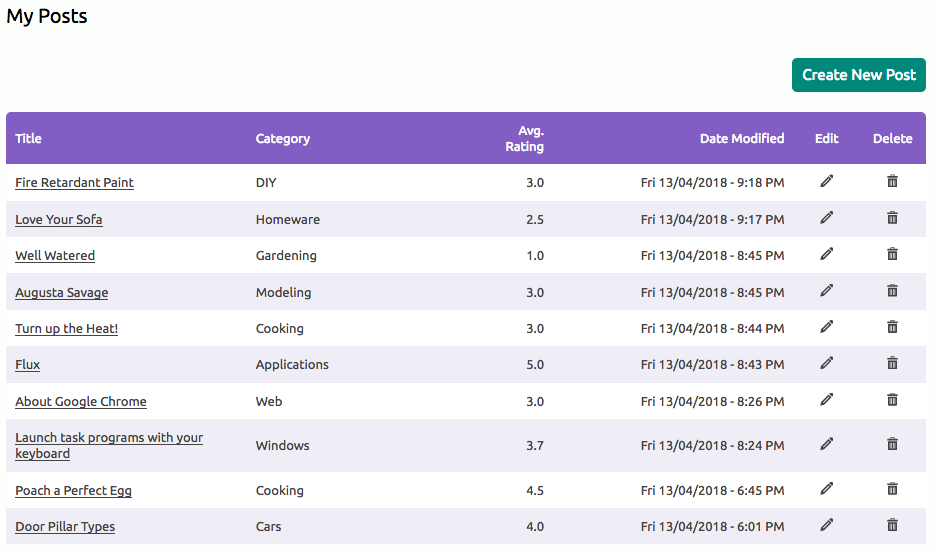

# Wiki

Simple Wiki webapp that uses a bespoke MVC CMS framework I wrote for Uni. It provides registration, login and logout functionality for users, logged-in users may post new wiki articles and rate existing articles. The CMS was originally created as the use of third-party frameworks was not allowed.

The wiki uses a newer version of my CMS than [my bookstore webapp](https://github.com/annahowell/Bookstore).

## Installation

1. Run `composer install` from the root directory
2. Run wiki\_create\_inset.sql to create and populate the 'wiki' database
3. Set your database IP, port, user and password in Application/config.php
4. Point your httpd to the root folder with URL re-writes enabled

### Login details

User: anna  
Pass: Password123  
(Or use the registration page to make an account)

## Screenshots

##### User Homepage  

  

##### User posts page  

##### Wiki item details  

